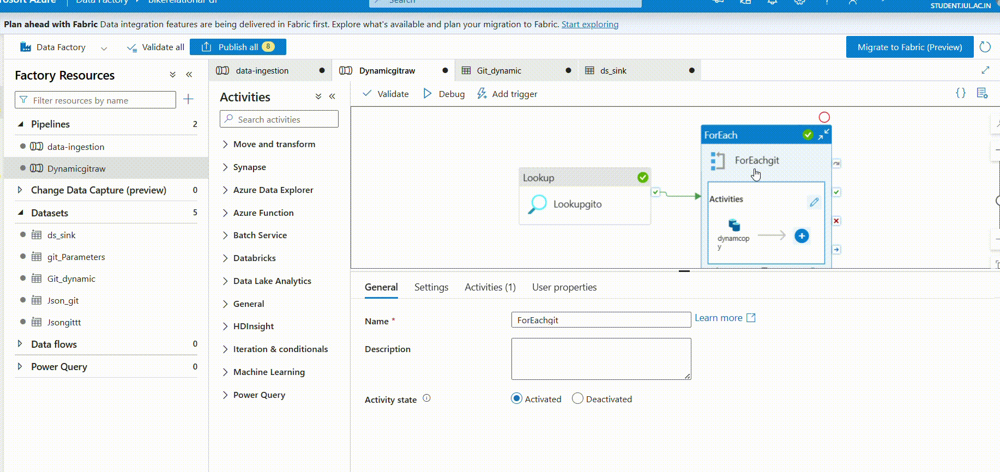

# CloudWeave: Data Engineering Pipeline on Azure

## 🧭 Introduction

In today’s data-driven ecosystem, organizations rely on scalable and efficient data pipelines to transform raw data into meaningful insights.

'**CloudWeave**' is an end-to-end data engineering project built on Microsoft Azure that demonstrates how modern cloud services can be integrated to design robust ETL workflows.

This project simulates a real-world scenario where ****'bike relational data'**** is collected from multiple external sources, processed using distributed systems, and stored in a structured format for analytics and decision-making.

---

## 🎯 Project Objectives

* Build a **scalable ETL pipeline** using Azure services
* Integrate **multiple data sources** (APIs + GitHub datasets)
* Perform **distributed data processing** using PySpark
* Implement **data warehousing** using Azure Synapse
* Enable **analytics-ready datasets**

---

## 🏗️ High-Level Architecture

---

## 🔄 End-to-End Workflow

### 1️⃣ Data Ingestion (Azure Data Factory)

The pipeline begins with extracting data from multiple sources:

* **REST APIs** (semi-structured / real-time data)
* **GitHub datasets** (structured batch data)

Azure Data Factory is used to:

* Build and manage pipelines
* Automate data ingestion workflows
* Orchestrate movement of data into cloud storage

🎥 **ADF Pipeline Preview (16-sec demo)**

---

### 2️⃣ Data Storage (Azure Data Lake)

All ingested data is stored in Azure Data Lake for:

* Centralized storage of raw and processed data
* Scalability for large datasets
* Easy integration with downstream services

---

### 3️⃣ Data Transformation (Azure Databricks - PySpark)

Data transformation is performed using Azure Databricks:

* Cleaning missing or inconsistent data
* Transforming and structuring datasets
* Performing joins and aggregations
* Creating derived fields for analysis

PySpark enables distributed processing, making the system efficient and scalable.

---

### 4️⃣ Data Warehousing (Azure Synapse Analytics)

Transformed data is loaded into Azure Synapse Analytics:

* Structured tables for analytics
* Optimized schema for performance
* Efficient querying of large datasets

---

### 5️⃣ Data Analysis (SQL)

SQL is used to extract insights and perform analysis:

* Aggregations and KPI calculations
* Trend and pattern analysis
* Business-level queries for reporting

---

## 🛠️ Tech Stack

| Layer        | Technology Used            |
| ------------ | -------------------------- |
| Ingestion    | Azure Data Factory         |
| Storage      | Azure Data Lake            |
| Processing   | Azure Databricks (PySpark) |
| Warehousing  | Azure Synapse Analytics    |
| Querying     | SQL                        |
| Data Sources | REST APIs, GitHub          |

---

## 🌟 Key Highlights

* 🔹 End-to-end Azure-based ETL pipeline
* 🔹 Integration of API and GitHub datasets
* 🔹 Scalable data processing using PySpark
* 🔹 Cloud-based data warehousing with Synapse
* 🔹 Production-like pipeline orchestration

---

## 🚀 Real-World Relevance

This project reflects how organizations:

* Build **cloud data pipelines**
* Process **large-scale datasets efficiently**
* Enable **data-driven decision making**

It demonstrates skills relevant for:

* Data Engineering roles
* Cloud Analytics roles
* Business Analytics with cloud integration

---

## 🔮 Future Enhancements

* 📊 Integration with Power BI dashboards
* ⚡ Real-time streaming (Event Hub / Kafka)
* 🔁 CI/CD pipeline automation
* 🛡️ Data validation & monitoring

---

## 💬 Final Thoughts

CloudWeave demonstrates my complete understanding of modern cloud-based data engineering workflows. From ingestion to analytics, this project reflects my practical implementation of scalable and efficient data pipelines used in industry.

---
